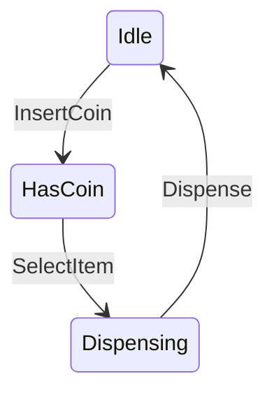
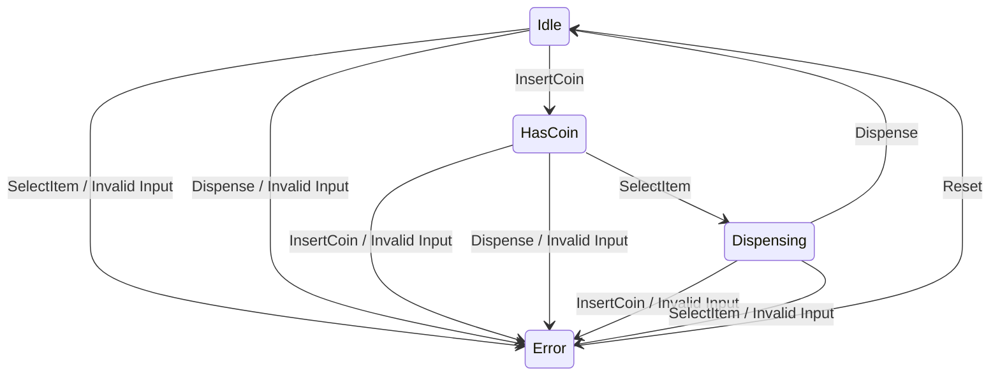

## setup
### Haskell
- https://docs.haskellstack.org/en/stable/install_and_upgrade/

### 主要コマンド
- stack build
- stack run
- stack test

## 状態遷移図
### onlyNomalCase

### withErrorCase

## 状態遷移表

| 現在の状態   | `InsertCoin`  | `SelectItem`  | `Dispense`  |
|--------------|---------------|---------------|-------------|
| **Idle**     | `HasCoin`     | `Error`       | `Error`     |
| **HasCoin**  | `Error`       | `Dispensing`  | `Error`     |
| **Dispensing** | `Error`     | `Error`       | `Idle`      |

